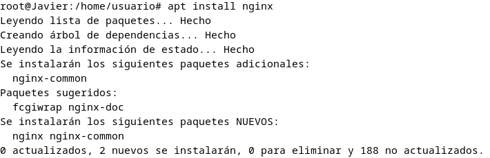

# Instalación

Para la instalación de Nginx, primeramente haermos uso del comando apt install nginx, esto instala los paquetes necesarios para hacer correr nginx.

Después, usaremos los comandos sudo systemctl start nginx y sudo systemctl enable nginx para iniciar el servicio y habilitar el inicio automático respectivamente.

