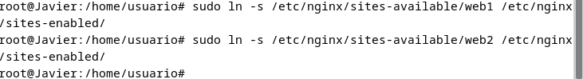

# Casos practicos

a) Versión de Nginx instalado

El comando para comprovbar la version de nginx que tenemos instalado en nuestro equipo es:

b) Servicio asociado

El comando que usaremos para comprobar el servicio de nginx es:

c) Ficheros de configuración

El archivo principal de configuración se encuentra en:

Los archivos de configuración de sitios están en:

d) Página web por defecto

Modificar la página por defecto:

Editar el archivo index.html en la ubicación por defecto:

e) Virtual Hosting

Configurar dos sitios web:

Creamos los directorios:

Creamos los archivos index.html:

Configuramos los archivos de sitios virtuales y añadimos la siguiente información:

Por último activamos los sitios:

Y reiniciamos nginx:

Accedemos a web1 y web2:

